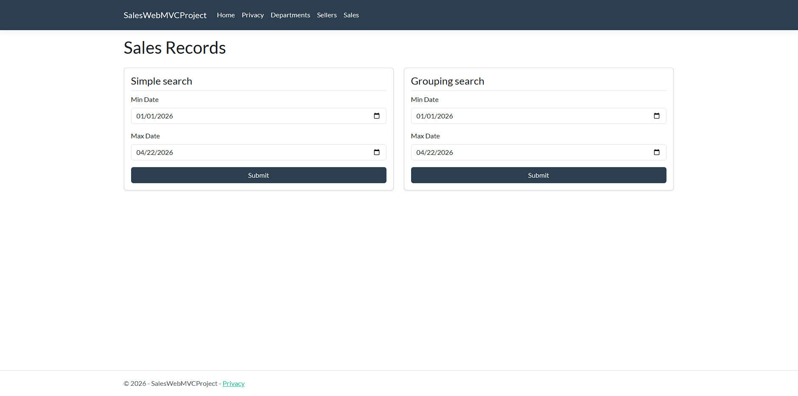
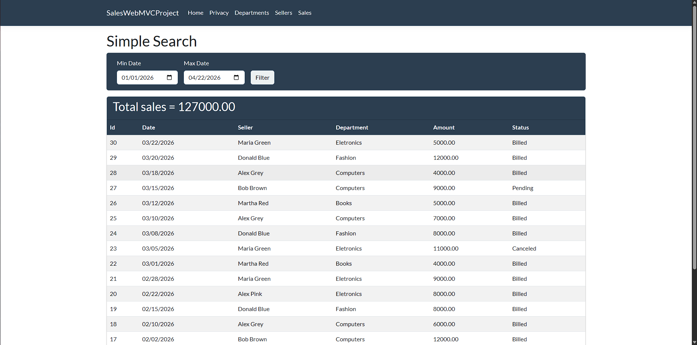
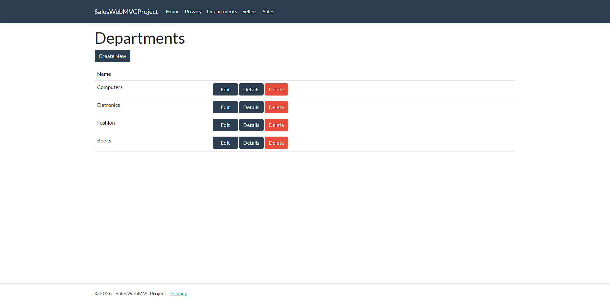

# Sales Web MVC Project

A comprehensive web-based management system for sales teams, departments, and performance reporting. Built with ASP.NET Core MVC and upgraded to .NET 9, following modern full-stack development practices.

This project was initially developed as part of the [C# Complete course by Nelio Alves](https://www.udemy.com/course/programacao-orientada-a-objetos-csharp/), 
originally built on .NET Core 2.1 and **migrated and upgraded to .NET 9** by me, alongside 
significant frontend customizations — including color palette, button styling, UI components, 
and the Privacy page, which was rebuilt from scratch.

---

## 📸 Screenshots

### Sales Records


### Simple Search with Results


### Departments Management


---

## ✨ Key Features

- **Full CRUD Management** — Complete control over Sellers and Departments
- **Business Intelligence Reports** — Filterable sales records with Simple Search and Grouping Search (by department) using optimized LINQ queries
- **Robust Architecture** — Service Layer pattern to decouple business logic from Controllers
- **Custom Exception Handling** — Graceful management of database integrity and concurrency errors (e.g., preventing deletion of departments with active sellers)
- **Auto-Seeding** — Integrated SeedingService to automatically populate the database with test data on first run
- **Responsive UI** — Styled with Bootstrap 5 and the Flatly theme

---

## 🛠️ Tech Stack

| Layer | Technology |
|---|---|
| Language | C# 13, .NET 9.0 |
| Framework | ASP.NET Core MVC |
| ORM | Entity Framework Core (Code-First) |
| Database | MySQL 8.4 LTS |
| Frontend | Razor Views, HTML5, CSS3, JavaScript, Bootstrap 5 |
| DevOps | Docker & Docker Compose |

---

## 🚀 How to Run Locally

### Prerequisites
- [.NET 9 SDK](https://dotnet.microsoft.com/download)
- [Docker Desktop](https://www.docker.com/products/docker-desktop/)

### 1. Clone the repository
```bash
git clone https://github.com/HayziVV/SalesSystem-AspNetCore
cd SalesWebMVCProject
```

### 2. Start the database
Ensure your database is running and create a appsettings.json file
*Here's an example of an appsettings.json*
```json
{
  "Logging": {
    "LogLevel": {
      "Default": "Information",
      "Microsoft.AspNetCore": "Warning"
    }
  },
  "AllowedHosts": "*",
  "ConnectionStrings": {
    "SalesWebMVCProjectContext": "Server=localhost;Port=yourport;Database=yourdatabase;Uid=root;Pwd=yourpassword;"
  }
}
```
Make sure your MySQL instance is running before proceeding.

### 3. Apply migrations
Create the database schema using the Package Manager Console:
```bash
Update-Database
```

### 4. Run the application
Press `Ctrl+F5` (without debugging) or `F5` (with debugging) in Visual Studio.

The SeedingService will automatically populate the database with test data on first run.

---


## 👤 Author

**Vitor Henrique Vercezi**

[](https://www.linkedin.com/in/vítor-vercezi-b7917335b/)
[](https://github.com/HayziVV)